### Hugo FRANGIAMONE
#### 2023-03-01
# Framework-based Programming - Assignment 1
## Introduction
This repo contains the code for the first assignment of the course Framework-based Programming at the Institut Teknologi Sepuluh Nopember (ITS) Surabaya, Indonesia. The assignment is to create a simple MAUI application that displays information about the solar system. The application is to be written in C# using the MAUI framework.

## The Application
### Exercise n°1
The instruction can be found [here](https://learn.microsoft.com/en-us/training/modules/create-multi-page-apps/3-exercise-implement-flyout-navigation).

Open the solution at `exercise1/start/Astronomy/Astronomy.sln` and run the application. The application should look like this:

When clicking on the moon button at the top-left corner, the application should display the following:
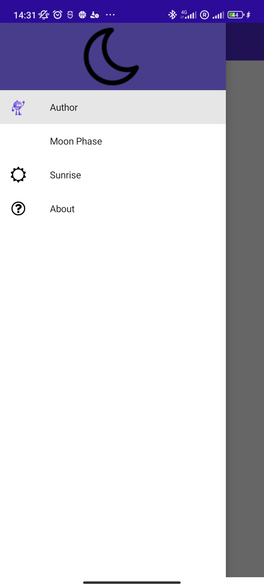

We can now see that the application is using a flyout menu to display all the pages available. The flyout menu is a component of the MAUI framework that can be used to display information in a side menu. The flyout menu is displayed when the user clicks on the button at the top-left corner of the application. The flyout menu can be closed by clicking on the button again or by clicking outside of the menu.

Upon clicking on the "moon phase" button, the application should display the following:
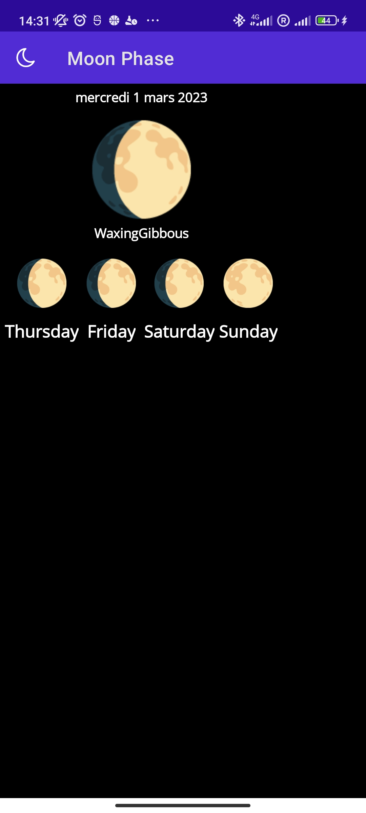

Clicking instead on the "Sunrise" or "About" button should display one of the following:
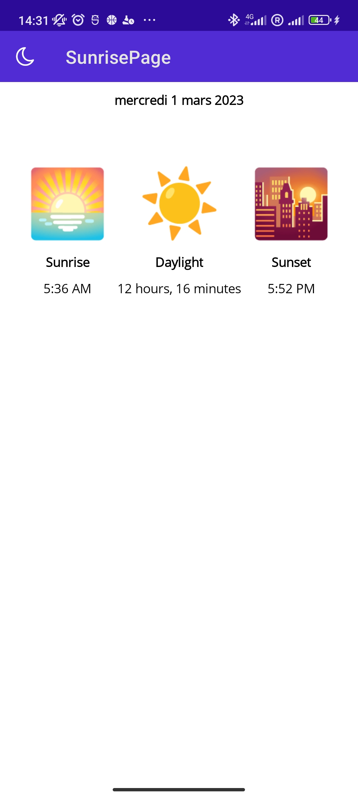
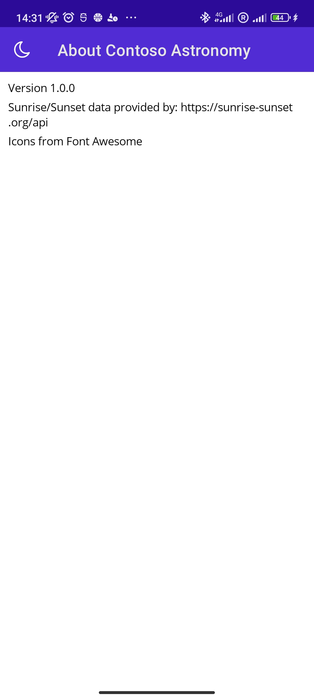

### Exercise n°2
The instruction can be found [here](https://learn.microsoft.com/en-us/training/modules/create-multi-page-apps/5-exercise-implement-tab-navigation).

Open the solution at `exercise2/start/Astronomy/Astronomy.sln` and run the application. The application should look like this:

When clicking on the moon button at the top-left corner, the application should display the following:
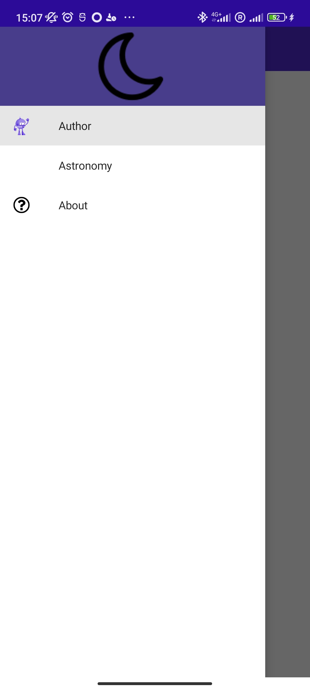

We can now see that the application is using an *Astronomy* page. Opening it should look like this:
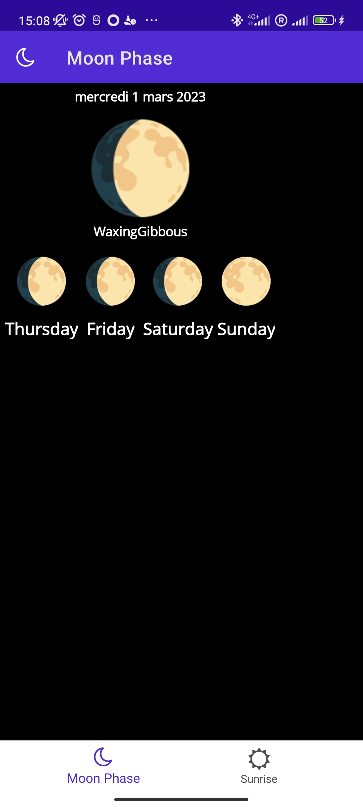

We can see the two tab at the bottom of the screen. Clicking on the "Sunrise" tab should display the following:
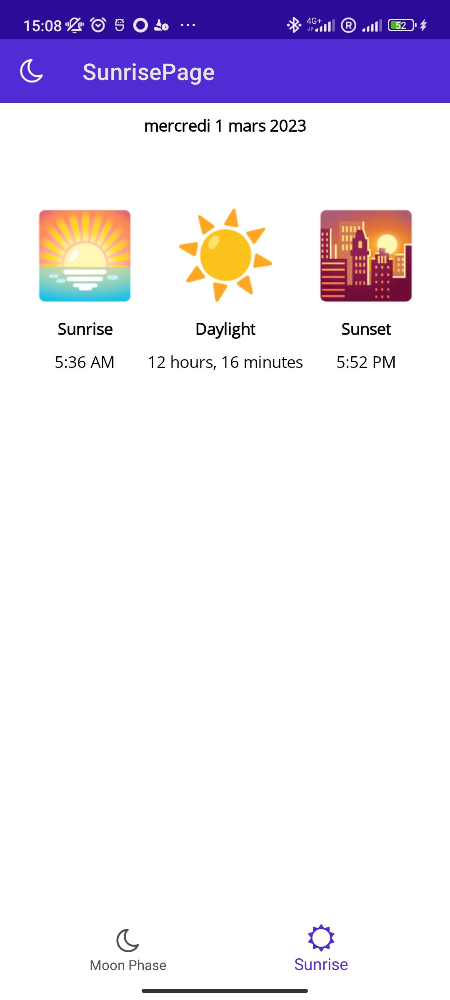

Clicking on the "About" page should still display the following:
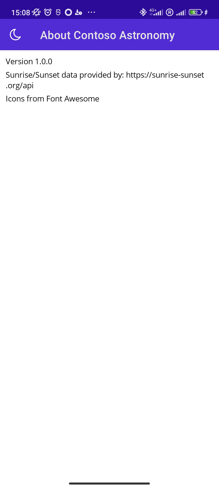

### Exercise n°3
The instruction can be found [here](https://learn.microsoft.com/en-us/training/modules/create-multi-page-apps/7-exercise-use-tabbed-pages-with-navigation-pages).

Open the solution at `exercise3/start/Astronomy/Astronomy.sln` and run the application. The application should look like this:

When clicking on the moon button at the top-left corner, the application should display the following:
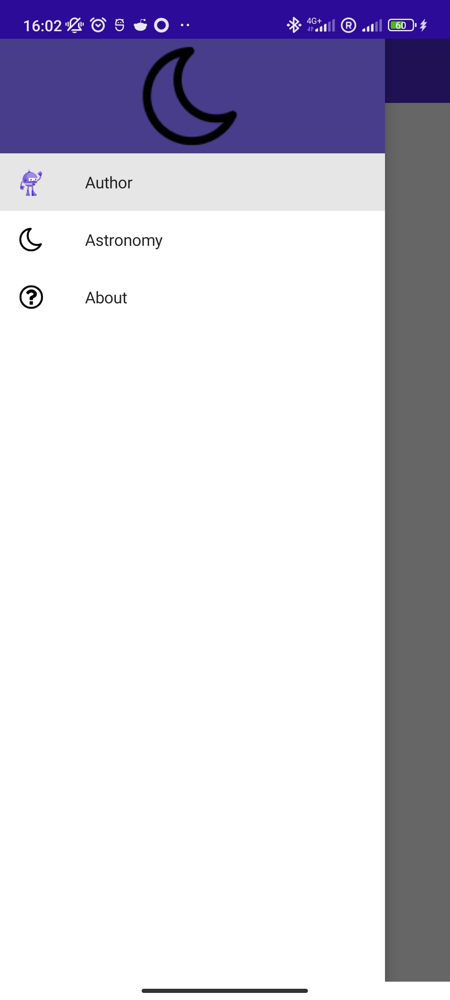

We can now see that the application is using an *Astronomy* page. Opening it should look like this:
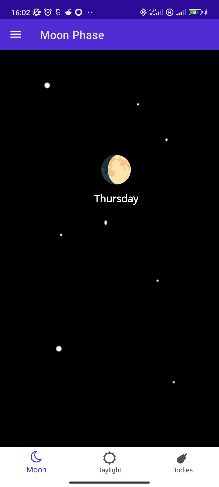

We can see the three tab at the bottom of the screen. Clicking on the "Sunrise" tab should display the following:
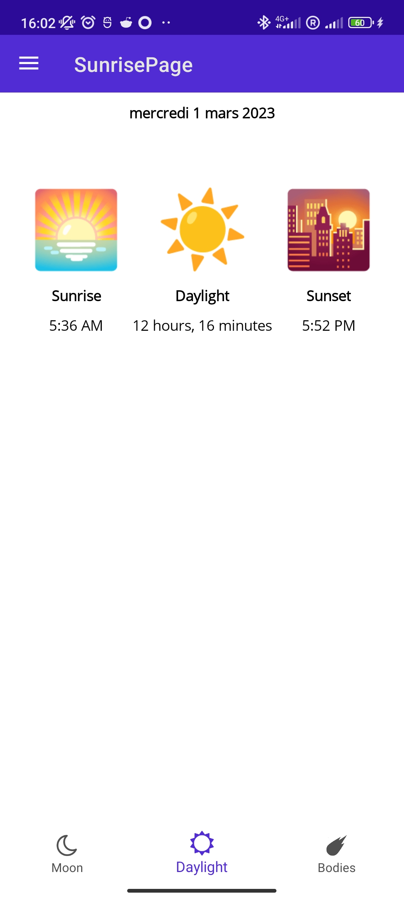

Finally, clicking on the "Bodies" tab should display the following:
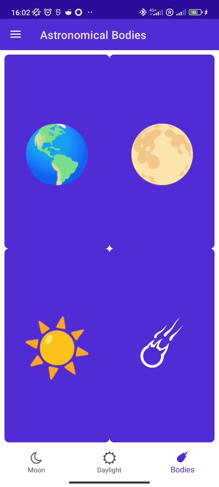

We can now see 4 buttons with each a celestial body. Clicking on one of them will display information about the body. For example, clicking on the "Earth" button should display the following:
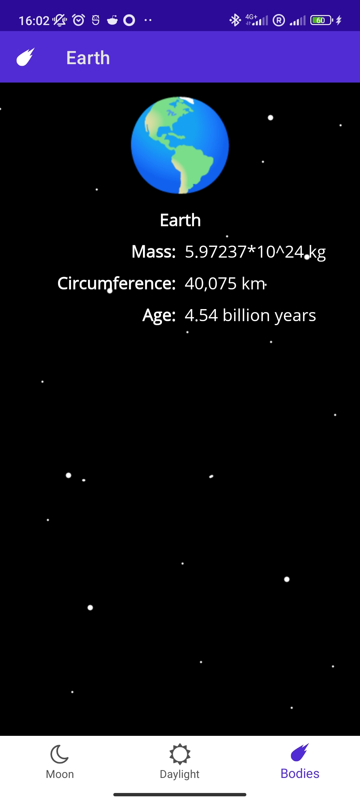

Hitting the return button of your phone will get you back to the bodies page.

Here are the other pages:
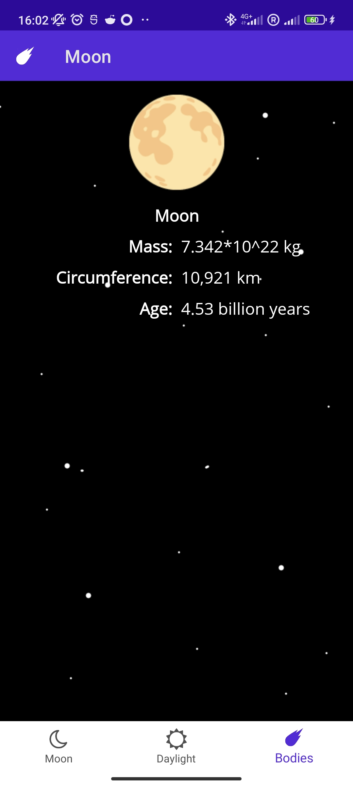

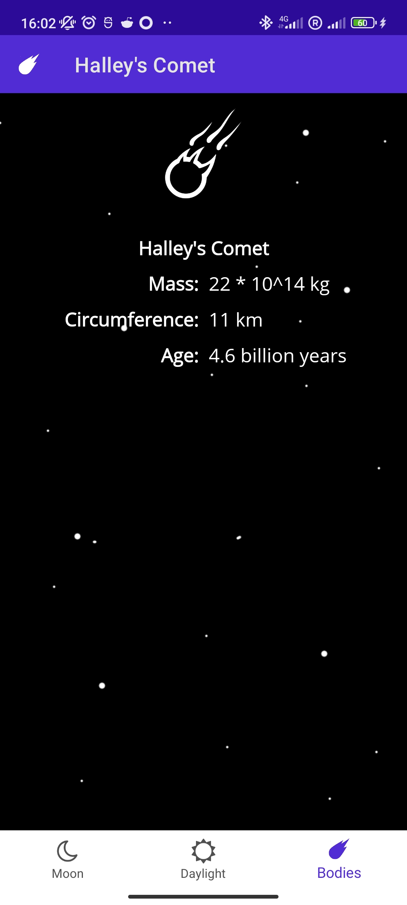

As per the other exercise, the "About" page should still display the following:
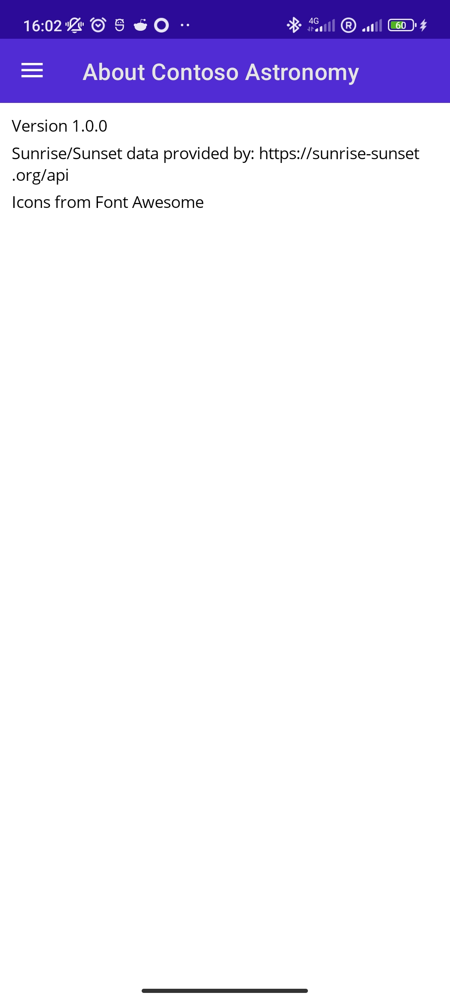

## Conclusion
This assignment was a good introduction to the MAUI framework. It was a good way to learn how to use the framework and how to create a multi-page application. The assignment was also a good way to learn how to create a basic interface using the MAUI framework.

I have now learn how to :
- Create an application using the MAUI framework
- Use the flyout menu
- Use the tabbed page
- Root our application in a navigation page